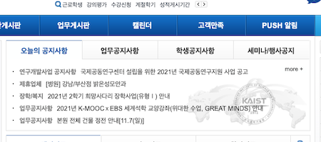

KAIST 대학원 총학생회 신입부원 가이드라인
===

<!-- 되도록 링크로 빼고 내용에는 간소함을 유지할 것! -->
## 1. 원총의 설립 근거 

### (1) 원총에 대한 기본 설명
- KAIST 대학원 총학생회는 **(1) 대학원생의 권리를 보호**하고 **(2) 대학원생의 복지를 향상**하기 위해 구성된 학생 자치단체입니다. 

 

- 1973년 제1대 대학원 총학생회가 설립된 이래, 2022년 우리는 제50대 대학원 총학생회 B-side 입니다. 
    - 3대 핵심 공약
        1. 학연장려금 충족 조건 축소
        2. 불합리한 학사 제도 개선
        3. 대학원생 복지 제도 개선

### (2) 한국과학기술원 대학원 학생회칙
- [한국과학기술원 대학원 학생회칙 바로가기](https://github.com/kaistgsa/organization-bylaw/blob/main/한국과학기술원-대학원-학생회칙.md)
- 원총 활동의 모든 기반이 되는 규정
- 회칙 변경을 위해서는 중앙운영위원회의 승인을 받아야 함.

### (3) KAIST 대학원 총학생회 조직 구성
- [한국과학기술원 대학원 학생회칙](https://github.com/kaistgsa/organization-bylaw/blob/main/한국과학기술원-대학원-학생회칙.md) 상의 총학생회 구조

    > 제1장 총칙  
    > 
    > 제1조 (명칭) 본회는 한국과학기술원 대학원 총학생회라 칭한다.  

    > 제5조 (구성) 본회는 제2조의 목적을 달성하기 위하여 학생총회와 3개의 협력기구(대학원 생활관자치회, 카이스트 협동조합, 입주업체모니터링위원회), 그리고 아래의 6개 산하기구로 구성된다.  
    >   1. 중앙운영위원회(이하 중운위)  
    >   2. 학생회장단(학생회장, 부학생회장)  
    >   3. 학생회 집행부  
    >   4. 대학원 동아리연합회  
    >   5. 대학원생 인권센터  
    >   6. 대학원 기혼자자치회  

- KAIST 대학원 총학생회 조직도  


- 대학원 총학생회는 학생총회, 6개의 산하기구, 그리고 3개의 협력기구로 구성됩니다.  

    | 이름 | 줄임말 | 구분 | 설명 | 
    |:---:|:---:|:---:|---|
    | [**학생총회**](https://github.com/kaistgsa/organization-bylaw/blob/main/한국과학기술원-대학원-학생회칙.md#제2장-학생총회) | - | - | 대학원 총학생회 최고의결기관으로 대전 본원 소속의 석, 박사과정 학생(재학/휴학생)으로 구성됨. 학생총투표, 선거관리위원회 등을 포함 |
    | [**학생 회장단**](https://github.com/kaistgsa/organization-bylaw/blob/main/한국과학기술원-대학원-학생회칙.md#제4장-학생회장단) | - | 산하기구 |  학생회장, 부학생회장(한 명 혹은 두 명) |
    | [**학생회 집행부원**](https://github.com/kaistgsa/organization-bylaw/blob/main/한국과학기술원-대학원-학생회칙.md#제5장-집행부) | - | 산하기구 |  ⭐️최고집행기구⭐️ 학생회장, 부학생회장, 각부 부장 및 임원 |
    | [**중앙운영위원회**](https://github.com/kaistgsa/organization-bylaw/blob/main/한국과학기술원-대학원-학생회칙.md#제3장-중앙운영위원회) | 중운위 | 산하기구 |  학생총회의 결정권을 위임받을 수 있는 의결기구. 학생회장단, 학생 자치단체와 학과의 대표자들로 구성 |
    | [**대학원생 인권센터**](https://github.com/kaistgsa/organization-bylaw/blob/main/한국과학기술원-대학원-인권센터-회칙.md) | - | 산하기구 | 대학원생 학우들의 인권에 관련된 전반적인 사항들을 개선하기 위해 설립된 ⭐️학생 자치기구⭐️ |
    | [**대학원 동아리연합회**](https://github.com/kaistgsa/organization-bylaw/blob/main/한국과학기술원-대학원-동아리연합회-회칙.md) | 동연 | 산하기구 | 대학원생 동아리 활동을 할 수 있도록 재정적, 행정적 지원을 수행 |
    | [**기혼자자치회**](https://github.com/kaistgsa/organization-bylaw/blob/main/한국과학기술원-대학원-기혼자자치회-회칙.md) | 기자회 | 산하기구 | 결혼 생활 중이거나, 결혼에 관심이 있는 사람들이 모여 정보를 공유하고 협력하기 위해 설립된 학생 자치기구 |
    | [**대학원 생활관자치회**](https://github.com/kaistgsa/organization-bylaw/blob/main/대학원-생활관자치회-회칙.md) | 생자회 | 협력기구 | 대학원생 생활관에 거주하는 학생들의 권익을 대변하는 학생 자치기구 |
    | [**카이스트 협동조합**](https://github.com/kaistgsa/organization-bylaw/blob/main/카이스트-협동조합-정관.md) | 협동조합 | 협력기구 | 소비, 문화, 환경 등을 더 나은 것으로 가꾸기 위해 학교 구성원이 스스로 조직한 단체 (학부+대학원) |
    | [**입주업체모니터링위원회**](https://github.com/kaistgsa/organization-bylaw/blob/main/입주업체모니터링위원회-회칙.md) | 입모위 | 협력기구 | 교내 입주업체에 대한 학생 주도 평가와 계약에 대한 그 평가의 실질적 반영을 통해 업체들에 대한 학생들의 영향력을 높이고 업체 서비스 품질을 개선하는 학생 자치단체 (학부+대학원) |


## 2. 중앙운영위원회와의 관계 

- [한국과학기술원 대학원 학생회칙](https://github.com/kaistgsa/organization-bylaw/blob/main/한국과학기술원-대학원-학생회칙.md)에 나타난 집행부와의 관계 

> 제3장 중앙운영위원회  
> 제16조 (지위) 중운위는 학생총회의 결정권을 위임받을 수 있는 의결기구로서 다양한 학생 자치단체와 학과의 대표자들로 구성되어 학내 제반 사항들을 논의한다.  
> 제20조 (업무 및 권한) 중운위는 다음과 같은 업무 및 권한을 가진다.  
>   1. 본회 활동의 기본 방향에 대한 심의 의결권  
>   2. 회칙 개정의 발의 및 의결권  
>   3. 각 자치단체의 업무 계획 및 결과 보고 심의권  
>   4. 학생총회 소집 요구권  
>   5. 학생회비 및 예산 결산의 심의 및 승인권: 감사를 위한 특별 조치를 필요로 할 때에는 각 학부 대표 1인씩으로 구성되는 특별위원회를 둘 수 있다.  
>   6. 학생회장단 및 집행부 각 부 부장, 인권센터장의 탄핵권  
>   7. 학사 운영과 학내 생활에 있어서의 중요한 사안에 대한 조치  
>   8. 집행부 각 부 부장의 총회 출석 요구권  
>   9. 각 자치 단체의 선거와 운영에 관련하여 제기되는 사항에 대한 심의 의결권  
>   10. 각 자치단체 및 특별기구의 운영 회칙에 대한 심의 의결권  


- 매 학기 2회 이상 개최 (매 학기 시작 전후 30일 이내). 
- 👉[중앙운영위원회 회의 기록](https://github.com/kaistgsa/CMCM)👈
- 매 학기 **사업계획서**를 작성하고 중운위에서 인준을 받아야함! 또한, 매 학기말 사업이 끝나면 총 예산사용 내역과 함께 **사업보고**를 함!

## 3. 자치단체와의 관계 

- 산하기구는 원총의 관리하에 활동하는 자치단체. 
- 협력기구는 원총과는 독립적인 단체로서, 협력하는 자치단체.

- 원총과 긴밀한 관계를 유지하는 단체 순서
     - 인권센터 > 기자회 > 동연 > 협동조합 > 입모위 > 생자회
- 자치단체장(인권센터 상담원 포함)은 원총에서 활동비를 전부 또는 일부 지급

- [한국과학기술원 대학원 학생회칙](https://github.com/kaistgsa/organization-bylaw/blob/main/한국과학기술원-대학원-학생회칙.md)에 나타난 집행부와 자치단체의 관계 

> 제7장 대학원 생활관자치회  
> 제45조 (집행부와의 관계) 대학원 생활관자치회는 집행부와의 원활한 상호협력 및 업무감사를 위해 아래와 같은 집행부와의 관계를 유지할 의무가 있다.  
>   1. 집행부 간부 중 1인이 생활관자치회의 간부로서 발언권과 의결권을 가지며 관련된 업무를 수행한다.  
>   2. 생활관자치회장은 대학원 총학생회 집행부 정기회의에 월 1회 이상 참석하여 생활관자치회 사업 경과보고 및 향후 계획을 제시한다. 또한, 집행부의 업무 및 예산집행이 원활히 돌아가고 있는지 감시한다.  
<br>

> 제8장 대학원 동아리연합회  
> 제50조 (집행부와의 관계) 대학원 동아리연합회는 집행부와의 원활한 상호협력 및 업무감사를 위해 아래와 같은 집행부와의 관계를 유지할 의무가 있다.  
>   1. 집행부 간부 중 1인이 대학원 동아리연합회의 간부로서 발언권과 의결권을 가지며 관련된 업무를 수행한다.  
>   2. 대학원 동아리연합회장은 대학원 총학생회 집행부 정기회의에 월 1회 이상 참석하여 동아리연합회 사업 경과보고 및 향후 계획을 제시한다. 또한, 집행부의 업무 및 예산집행이 원활히 돌아가고 있는지 감시한다.  
<br>

> 제9장 입주업체모니터링위원회  
> 제55조 (집행부와의 관계) 대학원 총학생회 집행부와 입주업체모니터링위원회의 원활한 의사소통 및 상호협력을 위해, 입주업체모니터링위원장은 대학원 총학생회 집행부 정기회의에 월 1회 이상 참석하여 입주업체모니터링위원회 사업 경과보고 및 향후 계획을 제시한다. 또한 예산 감사 특별위원회에서 요청 시 이를 공개하고 활동을 증빙할 의무를 가진다.  
<br>

> 제10장 대학원 기혼자자치회  
> 제60조 (집행부와의 관계) 대학원 기혼자자치회는 집행부와의 원활한 상호협력 및 업무감사를 위해 아래와 같은 집행부와의 관계를 유지할 의무가 있다.  
>   1. 집행부 간부 중 1인이 기혼자자치회의 회원으로서 발언권과 의결권을 가지며 관련된 업무를 수행한다.  
>   2. 대학원 기혼자자치회장은 대학원 총학생회 집행부 정기회의에 월 1회 이상 참석하여 기혼자자치회의 사업 경과보고 및 향후 계획을 제시한다. 또한, 집행부의 업무 및 예산집행이 원활히 돌아가고 있는지 감시한다.  
<br>

> 제11장 대학원생 인권센터  
> 제65조 (집행부와의 관계) 대학원생 인권센터는 집행부와의 원활한 상호협력 및 상호업무감사를 위해, 센터장이 매주 개최되는 집행부 정기회의에 참석하여 센터장 및 각 학생상담원의 주간 업무를 보고하고 주간 계획을 제시해야 한다.  
<br>

> 제12장 카이스트 협동조합(이하 협동조합)  
> 제69조 (집행부와의 관계) 협동조합은 집행부와의 원활한 상호협력 및 업무감사를 위해 아래와 같은 집행부와의 관계를 유지할 의무가 있다.  
>   1. 집행부 간부 중 1인이 협동조합의 감사로서 발언권과 의결권을 가지며 관련된 업무를 수행한다.  
>   2. 협동조합은 대학원 총학생회 집행부 정기회의에 월 1회 이상 참석하여 협동조합의 사업 경과보고 및 향후 계획을 제시한다. 또한, 집행부가 업무와 예산집행을 합리적으로 진행할 수 있도록 견제하고 협력한다.  


## 4. 학교 주요 부서에 대한 이해


### 원총이 상대해야 하는 학교 조직 / 사람

| 대상 | 설명 | 
|:---:|---|
| 총장 | - 말이 필요 없는 우리 학교 No.1 최고 의사결정권자이기 때문에, 중요한 문제가 아니면 잘 만나주지 않음. <br> - 한 번 만날 때, 최우선 순위에 있는 내용을 들어달라고 해야 함. <br> - 학기에 한 번 정도 만나게 됨. | 
| 교학부총장 | - 사실상 학교 No.2 교내 최고의사결정기구인 <학사연구심의위원회>의 위원장. <br> - <등록금심의위원회>의 위원장. <br> - 총장을 안거치고도 교학부총장 선에서도 해결 가능한 문제들이 있음. | 
| 대외부총장 | - 기획팀, 예산팀, 회계팀 등 주요부서의 의사결정권자이기 때문에 중요. <br> - 그러나 원총과 접점은 많지 않음. | 
| 교무처 | - 교무팀, 학적팀, 교학기획팀 소속. <br> - 학사제도와 관련된 제도 개선을 할 때 반드시 거쳐야 하는 조직. <br> - [자세한 업무분장](https://rule.kaist.ac.kr/lmxsrv/law/lawFullContent.do?SEQ=96&SEQ_HISTORY=3192#46)<br><br> - 교무팀: 교원 인사관리 (원총과 접점 많지 않음)<br> - 학적팀: 수업, 시험, 학적상태, 수강신청, 재수강, 납입금 고지 등등 <br> - 교학기획팀: 학사운영, 학사제도 전반<br> |
| 학생정책처장<br>학생생활처장 | - 매년 다를 수 있으나 올해에는 거의 늘 같이 움직임. <br> - 원총과 가장 자주 만나는 처장들. <br><br> - [학생정책처 업무](https://rule.kaist.ac.kr/lmxsrv/law/lawFullContent.do?SEQ=96&SEQ_HISTORY=3192#63) <br>- [학생생활처 업무](https://rule.kaist.ac.kr/lmxsrv/law/lawFullContent.do?SEQ=96&SEQ_HISTORY=3192#67)<br><br>   - 학생지원팀: 학생회 활동 지원부서, 전문연 관리 등. 원총과 접점이 가장 많은 학교 부서. 늘 우호적인 관계를 유지하는 것이 좋지만, 요청하는 것을 다 수락해서도 안됨. <br> - 장학복지팀:  근로장학금, 장학금, 의료상조회, 학생복지 업무 전반. 종종 만나게 되는 부서. <br> - 학생생활팀:  생활관 관련 업무. 생활관자치회와 상당한 유관부서. 원총과는 만날 기회 많지 않음. <br> - 상담센터:  학생상담업무 담당. 인권센터와 긴밀한 관계. <br> - (새내기과정학부)  | 
| 인권윤리센터 | 학교 인권정책 수립, 상담. 인권센터와 긴밀한 관계. 인권관련 기구 중 가장 권한이 있는 부서. | 

* 처장은 일반적으로 모두 보직 교수임.

### 원총 참석 교내 위원회 목록

1. 학사연구심의위원회
2. 교과과정심의위원회
3. 대학평의원회
4. 등록금심의위원회
5. 학생상벌위원회
6. 위탁업체선정위원회
7. 클리닉 운영위원회
8. 연구실안전관리위원회
9. 전문연구요원제도개선위원회
10. 의료상조회 이사회
11. 체육시설위원회
12. 학생생활위원회
13. 건강정책위원회
14. 기타 위원회


## 5. 원총의 협업툴 

<details close>
<summary>크롬 (Chrome)</summary>

- 크롬 브라우저 분리의 배경
```
A: 제 브라우저 히스토리를 공유하길 원치 않아요! 
B: 그렇군요? 저도 당신의 히스토리를 공유 받고 싶지 않아요!
```
- 브라우저에서 제공하는 다중 프로필 기능을 사용해 보세요. **노란색 브라우저**가 보인다면 성공!
- 원총 구글 드라이브, 메일, 원총 홈페이지 등 많은 웹사이트를 접속할 땐 이 노란 브라우저에서 접속하세요. 비밀번호 자동 저장까지도 공유된답니다.


</details>

<details close>
<summary>GSA 홈페이지</summary>

- 👥 학우의 관점
    - GSA 홈페이지는 원총에서 나가는 모든 정보와 홍보가 집약된 아카이빙 장소입니다.
    - 원총뿐만 아니라 기혼자자치회 회원, 입주업체모니터링위원회의 위원, 입주업체 직원, 교내외 신문사 등 다양한 사람들이 드나들고 있습니다.
    - 주요 페이지 소개:
        - [공지사항 게시판](https://gsa.kaist.ac.kr/notice)
        - [원총뉴스](https://gsa.kaist.ac.kr/news/)
        - [진행 중인 서비스](https://gsa.kaist.ac.kr/services)
        - [학과 학생행사지원사업](https://gsa.kaist.ac.kr/deptsupport)
        - [교수와 학생의 신의존중 헌장](https://gsa.kaist.ac.kr/charter)
        - [연구환경실태조사 보고서](https://gsa.kaist.ac.kr/regular_survey)
        - [대학원생 인권센터](https://gsa.kaist.ac.kr/hrc)
        - [기혼자자치회](https://gsa.kaist.ac.kr/married)
        - [입주업체모니터링위원회 공지사항](https://gsa.kaist.ac.kr/rms_notice)
        - [입주업체모니터링위원회 모니터링 일지(생활)](https://gsa.kaist.ac.kr/welfare_facilities_report)
        - [입주업체모니터링위원회 모니터링 일지(식당)](https://gsa.kaist.ac.kr/cafeteria_report)
    
- 🧑‍💼 원총의 관점 
    - 원총 홈페이지에 관리자로 로그인하시면 hidden 메뉴를 볼 수 있습니다.
    
    - 🔒 hidden 메뉴:
        - [대량 메일 발송 신청](https://gsa.kaist.ac.kr/adminMailshotRequestBoard)
            - 학우들을 대상으로 단체메일을 발송할 때 사용합니다.
            - 구글 드라이브와 연동되어 있어, 구글 드라이브 내 [X. 이메일 검토](https://drive.google.com/drive/folders/1NYwYfUDaasDduFWpjvnIWoWT6sMDZHlf)에 작성된 글을 불러오는 방식으로 구현되었습니다.
        - [회의실 예약](https://gsa.kaist.ac.kr/meetingroom)
            - 회의실은 자치단체와 모두 공유하기 때문에, 회의실 (서측회관 212호) 사용 시 예약이 필요합니다.
        - [학생회비 납부 확인](https://gsa.kaist.ac.kr/adminCheckPaymentStatuses)
            - 대학원 총학생회의 사업의 대다수는 학생회비 납부자를 우대합니다.
            - 해당 학기의 학생회비 납부 확인이 필요할 경우, 여기에 학번을 입력해 조회하세요.
            - 줄로 구분해 한번에 여러 학번의 학생회비 납부 여부를 조사할 수 있습니다.  
        - [서비스 신청 결과](https://gsa.kaist.ac.kr/adminServices)  
            - **서비스란?** 
                - 구글폼을 이용하는 행사들도 있지만, 원총 홈페이지에서 "서비스"라는 신청 서비스를 이용하는 행사도 있습니다.
                - 원총 홈페이지의 서비스를 사용하는 주 이유는, **학생회비를 납부한 학생들만 신청 가능하게끔 제한을 걸기** 위해서 입니다. (기자회 행사 등) 
            - 서비스 신청 방법
              
              
              
              
            - 슬랙의 [#49th_정보부_서비스_신청](https://kaist-gsa.slack.com/archives/C01PJ3FLNNR)을 참조해 주세요.
          
</details>


<details close>
<summary>이메일(Gmail, KAIST Dooray!)</summary>

- Gmail (gsa@gsa.kaist.ac.kr)
    - 라벨 분류작업: 회장단
    - 처리대기중: 자동 생성
    - 처리대기중인 메일 처리 재촉: 원무업무 담당자
    - 처리대기중 제거: 업무 담당자
    - 메일 보관: 회장
    - 48시간 내 답장을 원칙

- KAIST Dooray!(gsa-no-reply@kaist.ac.kr, grad@kaist.ac.kr)
    - 원총에서는 Gmail을 공식 이메일로 사용하고 있습니다. 다만, 대량 이메일을 발송할 때는 KAIST 구성원용 메일 시스템(Dooray!)를 사용합니다.
    - 대량 메일은 한 번 발송하고 나면 되돌릴 수 없다는 특성 때문에, 다른 홍보 채널과 다르게 정보부장이 최종 발송을 전담하고 있습니다.
    - 발송 전용으로만 사용한다는 원칙을 정해 두었지만, Dooray! 주소록에서 검색하거나 대량 메일에 직접 답장하는 경우가 빈번하여 Dooray! 이메일로 도착하는 모든 메일은 Gmail로 자동 전달하도록 되어 있습니다.

</details>

<details close>
<summary>카카오톡(Kakao Talk)</summary>

- 일반적으로 모든 부원이 참여하는 방은 **공지방**과 **잡담방**입니다.
- 공지방
    - 목적: 전체 회의 투표, 전체 논의 사항 전달 등
    - 구성: 대학원 총학생회 집행부와 대학원생 인권센터 구성원
    - 공지방은 알람을 켜주시고, 중요한 공지만 공유해 주시길 부탁드립니다.
     
- 잡담방: 
    - 목적: 자유로운 토론과 대화
    - 구성: 대학원 총학생회 집행부와 대학원생 인권센터 구성원
    - 잡담방의 알람은 꺼두셔도 좋지만, 현안의 follow-up을 위해 ❗️주기적인 확인❗️ 부탁드립니다.


</details>


<details close>
<summary>슬랙(Slack)</summary>

- https://kaist-gsa.slack.com
- 슬랙은 **TF/위원회/업무분장에 따라 소수의 인원만이** involve되어 있는 경우를 위해 사용하고 있습니다.  
- 제46대 대학원 총학생회 시절부터 사용해 왔으며, 기존 자료가 모두 아카이빙 되어 있습니다. ~~무료 plan이라 결제해야 볼 수 있을 거에요..~~  
- 필요에 따라 채널을 새로 생성하기도 합니다.  
- 누가 채널에 들어오고 들어오지 말아야하는 구분은 없습니다.
    - 담당자는 무조건 자기 채널에 있어야 합니다.
    - 관심있는 누구나 다른 채널에 들어가도 무방합니다.

- 모두가 들어오길 권장하는 채널
    - [#49th_원총뉴스](https://kaist-gsa.slack.com/archives/C01SUFB3VQU)
    - [#49th_정보부_서비스_신청](https://kaist-gsa.slack.com/archives/C01PJ3FLNNR)
    - [#49th_학교요청](https://kaist-gsa.slack.com/archives/C029HCZPL68)  
    - [#49th_학우민원](https://kaist-gsa.slack.com/archives/C027NLLQ68K)  
    - [#49th_홍보부](https://kaist-gsa.slack.com/archives/C01PSN1SWNA)  
    - [#49th_연구환경실태조사](https://kaist-gsa.slack.com/archives/C027UJVNK8R)  

- 관심이 있다면 들어오면 좋은 채널
    - [#49th_경품출납관리](https://kaist-gsa.slack.com/archives/C0226M68M7S)
    - [#49th_공간관리](https://kaist-gsa.slack.com/archives/C01PMBZNA1H)
    - ~~[#49th_식음료주문](https://kaist-gsa.slack.com/archives/C01PMC04CQK)~~ 있었지만 없었습니다.  
    - [#49th_중앙운영위원회](https://kaist-gsa.slack.com/archives/C026P3CTREC)
    - [#49th_상근](https://kaist-gsa.slack.com/archives/C025AUZTMQ8)

- 기능 소개
    - Channels
        - 업무별 채널 개설 가능
        - 채널 공개/비공개 설정 가능
    - Direct Message
    - App Integration
    - 장점
        - 내가 원하는 내용만 push 받을 수 있음. 
        - 검색이 용이함. 
        - 서식이 적용된 메시지 전송이 가능함. 
        - 연도를 뛰어넘는 대화의 아카이빙이 가능함. 
        - 다른 앱들과의 연동성이 좋음. (구글 드라이브, 캘린더, Dropbox 등) 


</details>


<details close>

<summary>깃헙(GitHub)</summary>

- https://github.com/kaistgsa
- 목적
    - 버전 관리
    - 협업
    - 정보 공개
- GitHub은 Git을 여러 사람이 편리하게 사용할 수 있도록 해 주는 호스팅 및 소셜 네트워크 서비스
- 보기
    - <https://github.com/kaistgsa/organization-bylaw>
    - <https://github.com/kaistgsa/CMCM>
- 편집하기
    - 🖊️ 수정 버튼을 눌러 바로 편집하기
    - 키보드에서 `.` 키를 눌러서 웹 에디터를 실행한 다음, 저장 및 커밋하기
    - (고급) Git 저장소를 clone하여 저장, commit, push하기
- 고급 사용법
    - <https://git-scm.com/book/ko/>
    - <https://www.youtube.com/watch?v=QisJiNmcsRQ&list=PLEuUpEnGYe0ZEpZfeVpnn-38k6xpLTgFH>
</details>


## 6. 원총의 홍보 방법 및 채널 

### 🌟 홍보의 목적

- 학우들에게 정보 전달과 의견 수렴을 목적으로 합니다.

### 🌟 홍보 10계명 

| 번호 | 내용 | 
|:---:|---| 
| 1 | **✔️ 스팸성으로 느끼지 않게 할 것** <br> - 학우들은 너무 바쁘다는 것을 명심! |
| 2 | **✔️ 딱딱하지 않게, 같은 학우로서 공감의 어조를 담을 것**   |
| 3 | **✔️ 부정확한 정보, 비문, 오탈자, 장황한 문장을 삼가할 것** <br> - 6천명의 학우를 대상으로 발송합니다. |
| 4 | **✔️ 대용량의 파일, 이미지의 첨부는 최대한 자제할 것** <br> - 필요 시 첨부파일이 아닌 링크로 대체 |
| 5 | **✔️ 가독성이 좋은 서식을 사용할 것** | 
| 6 | **✔️ 읽고싶은 제목으로 작성할 것**  |
| 7 | **✔️ 지저분한 링크를 사용하지 않고 되도록 신뢰도 높은 축약 링크를 사용할 것**<br> - 🚫 https://docs.google.com/forms/d/e/1FAIpQLSdjkFW18ELd8uQenQmY7e8m3mTKa0FApoLvHGe62rC7Hv2f0Q/viewform?usp=sf_link<br> - 👌 https://forms.gle/MsxFjFA7ks6fLc8X8 | 
| 8 | **✔️ 특별한 사유 없이 외국인 학생을 배제하지 말 것**    |
| 9 | **✔️ 다른 집행부원의 일정을 고려하여 충분히 여유를 갖고 홍보를 신청할 것** |
| 10 | **✔️ 공식 명칭을 사용할 것** <br> - 제49대VKAISTV대학원V총학생회 |


### 🌟 홍보 채널

<details close>
<summary>단체메일</summary>

- gsa@gsa.kaist.ac.kr 이 아닌 gsa-no-reply@kaist.ac.kr 로 발송되는 단체메일을 의미합니다.
- 발송 권한: 정보부장

</details>

<details close>
<summary>KAIST Portal</summary>

- [KAIST Portal 학생공지사항](https://portal.kaist.ac.kr/ennotice/student_notice)에 게시하고 있습니다.  
- KAIST Portal에 [원총/총학게시판](https://portal.kaist.ac.kr/ennotice/gsc_usc_notice)이 있지만, Portal 메인화면에 뜨지 않아 학생공지사항을 이용하고 있습니다.  
    
- 게시 권한:   
    - 집행부원 아무나 게시할 수 없고, 학생지원팀에 게시자를 공문으로 보내 권한을 얻은 이만 게시가 가능합니다. (현재: 회장단, 정보부장)   
        

</details>

<details close>
<summary>인스타그램</summary>

- https://www.instagram.com/kaist_gsa/  
- 모든 내용물을 게시하진 않으며, (1) 시각화가 용이하거나 (2) 최대한 학우들에게 친근히 다가갈 수 있는 콘텐츠를 위주로 게시합니다.  
- 게시 권한: 홍보부장 (+회장단, 정보부장 역시 비밀번호를 공유하고 있습니다.)  
- 이미지는 자체 제작도 가능하며, 망고보드의 템플릿을 이용할 수도 있습니다.  
- 이따금씩 인스타 자체의 이벤트를 진행하기도 합니다.  

</details>

<details close>
<summary>아라</summary>

- https://newara.sparcs.org/board/organization-notice?topic=grad-assoc  
- 유일하게 원총에서 공식적으로 소통하는 교내 커뮤니티.  
    - [대나무숲(밤부)](https://bamboofo.rest)는 익명성의 문제로 모니터링은 하지만 대응하지 않습니다.  
- 게시 권한: 홍보부장 (+회장단, 정보부장 역시 비밀번호를 공유하고 있습니다.)  

</details>

<details close>
<summary>원총뉴스</summary>

- https://gsa.kaist.ac.kr/news/  
- 매월 말에 발송되는 월간 뉴스레터입니다.  
- [Notion](https://www.notion.so/)을 이용해 작성하고 있습니다.  
    - 2021/06 까지는 Notion이 아닌 이미지를 사용했습니다.   
- 한 달 동안 있었던 원총의 크고 작은 소식과 상시 업무를 담아 보내고 있습니다.  
- 사업 담당자가 사업의 개요를 작성하면, 원총뉴스 담당자가 해당 내용을 취합해 글로 작성합니다.   
- 영문 번역은 [외주 업체](https://blog.naver.com/ImbacES)를 이용하고 있습니다.   

</details>

<details close>
<summary>원총위키</summary>

- https://gsa.kaist.ac.kr/wiki  
- 원총의 모든 사업과 정책 이슈를 담으려는 아카이브입니다.  
- 원총뉴스와 동일하게 사업 담당자가 작성한 사업 개요를 바탕으로, 원총위키 담당자가 해당 내용을 취합해 글로 작성합니다.   
- MediaWiki 위키 문법을 사용합니다.

</details>

### 🌟 홍보 프로세스
- 업데이트를 진행하고 있습니다.

## 7. 회계 (TBD)

## 8. 2022년 상반기 사업 
[하반기 사업 중운위 안건지에서 보기](https://github.com/kaistgsa/CMCM/blob/main/2021-1H-2st-CMC/%EC%9D%98%EA%B2%B0%EC%95%88%EA%B1%B4/2021%EB%85%84-%ED%95%98%EB%B0%98%EA%B8%B0-%EB%8C%80%ED%95%99%EC%9B%90-%EC%B4%9D%ED%95%99%EC%83%9D%ED%9A%8C-%EC%A7%91%ED%96%89%EB%B6%80-%EC%82%AC%EC%97%85%EA%B3%84%ED%9A%8D-%EC%98%88%EC%82%B0%EC%95%88-%EC%9D%B8%EC%A4%80.md)
<table>
<thead>
  <tr>
    <th>사업명</th>
    <th>담당</th>
    <th>사업 기간</th>
    <th>사업 개요 및 내용</th>
    <th colspan="2">사업 예산</th>
  </tr>
</thead>
<tbody>
  <tr>
    <td rowspan="2">물품대여사업</td>
    <td rowspan="2">문화국</td>
    <td rowspan="2">3월 ~ 8월</td>
    <td rowspan="2">원총이 보유하고 있는 비품 및 학생들의 수요가 높은 물품을 구매하여 대학원생들을 대상으로 상시 대여를 진행</td>
    <td>학생회계</td>
    <td>미정</td>
  </tr>
  <tr>
    <td>일반회계</td>
    <td>미정</td>
  </tr>
  <tr>
    <td rowspan="2">연구실 정보공개 플랫폼 구축</td>
    <td rowspan="2">정책국</td>
    <td rowspan="2">3월 ~ 8월</td>
    <td rowspan="2">연구실 인건비, 연간 논문실적, 졸업까지 걸리는 시간 등 연구실의 정량적 정보를 공개하여 신입생들의 연구실 선택에 도움을 주는 플랫폼 구축사업</td>
    <td>학생회계</td>
    <td>미정</td>
  </tr>
  <tr>
    <td>일반회계</td>
    <td>미정</td>
  </tr>
  <tr>
    <td rowspan="2">연구환경실태조사</td>
    <td rowspan="2">전체</td>
    <td rowspan="2">12월</td>
    <td rowspan="2">대학원생들의 연구 환경에 대한 정보를 공유하고, 관련 문제점을 해결하기 위한 연구 환경 조사</td>
    <td>학생회계</td>
    <td>미정</td>
  </tr>
  <tr>
    <td>일반회계</td>
    <td>미정</td>
  </tr>
  <tr>
    <td rowspan="2">옆랩학생 엽서</td>
    <td rowspan="2">문화국</td>
    <td rowspan="2">3월 ~ 8월</td>
    <td rowspan="2">대학원 생활을 진행하며 겪었던 문제, 고민 등을 공유할 수 있는 창구 마련을 위해 진행하는 주1회 구독 기반 뉴스레터 서비스</td>
    <td>학생회계</td>
    <td>미정</td>
  </tr>
  <tr>
    <td>일반회계</td>
    <td>미정</td>
  </tr>
  <tr>
    <td rowspan="2">원총위키 운영</td>
    <td rowspan="2">문화국</td>
    <td rowspan="2">3월 ~ 8월</td>
    <td rowspan="2">아카이빙의 역할을 하던 원총위키를 대학원 생활 전반적인 정보를 담은 콘텐츠로의 확장 및 교내 구성원 대상 홍보</td>
    <td>학생회계</td>
    <td>미정</td>
  </tr>
  <tr>
    <td>일반회계</td>
    <td>미정</td>
  </tr>
    <tr>
    <td rowspan="2">전문연 입소/퇴소 차량 지원</td>
    <td rowspan="2">사무국</td>
    <td rowspan="2">3월 ~ 8월</td>
    <td rowspan="2">전문연구요원에 편입된 박사과정 학생들에게 교통 편의를 제공하기 위해 논산훈련소까지 차량을 지원<br>※ 코로나19로 인한 예비군 훈련 취소로 예비군 훈련 입소/퇴소 차량 지원 사업 예산 편입</td>
    <td>학생회계</td>
    <td>미정</td>
  </tr>
  <tr>
    <td>일반회계</td>
    <td>미정</td>
  </tr>
   <tr>
    <td rowspan="2">예비군 입소/퇴소 차량 지원</td>
    <td rowspan="2">사무국</td>
    <td rowspan="2"></td>
    <td rowspan="2">※ 코로나19로 인한 예비군 훈련 취소로 예비군 훈련 입소/퇴소 차량 지원 사업 예산을 전문연 입소/퇴소 차량지원 사업으로 일괄편입함. </td>
    <td>학생회계</td>
    <td>미정</td>
  </tr>
  <tr>
    <td>일반회계</td>
    <td>미정</td>
  </tr>
  <tr>
    <td rowspan="2">카이밍글</td>
    <td rowspan="2">문화국</td>
    <td rowspan="2">3월 ~ 8월</td>
    <td rowspan="2">코로나19로 인한 비대면 환경 속에서 대학원생의 원활한 정보/경험 공유를 촉진</td>
    <td>학생회계</td>
    <td>미정</td>
  </tr>
  <tr>
    <td>일반회계</td>
    <td>미정</td>
  </tr>
  <tr>
    <td rowspan="2">테마강좌</td>
    <td rowspan="2">문화국</td>
    <td rowspan="2">3월 ~ 8월</td>
    <td rowspan="2">삶의 질을 향상시킬 수 있는 실용적인 특강 제공, 학생들에게 필요한 효율적이고 실질적인 도움을 기대</td>
    <td>학생회계</td>
    <td>미정</td>
  </tr>
  <tr>
    <td>일반회계</td>
    <td>미정</td>
  </tr>
  <tr>
    <td rowspan="2">하반기 취업박람회</td>
    <td rowspan="2">복지국</td>
    <td rowspan="2">3월 ~ 4월</td>
    <td rowspan="2">대학원생에게 기업 및 취업에 대한 정보 제공, 진로 탐색의 기회를 넓힐 것을 기대</td>
    <td>학생회계</td>
    <td>미정</td>
  </tr>
  <tr>
    <td>일반회계</td>
    <td>미정</td>
  </tr>
</tbody>
</table>

## 9. 2022년 업무분장

- 원총 업무는 일주일에 10시간 정도의 업무를 수행하는 것을 원칙으로 함.
- 업무는 기본업무와 추가업무로 구분.
  - 기본업무: 직위에 따라 수행해야하는 기본적인 업무. 활동비의 반대급부 성격. 기본업무라 할지라도 업무량은 변동 가능함.
  - 추가업무: 직위에 관계없이 추가 된 업무. 추가 업무는 인센티브 지급대상.
 
 ### 참고: 원총 인센티브 지급 기준
(1) 기본 업무 외에 추가 업무를 수행한 경우<br>
(2) 기본 업무가 과중된 경우<br>
(3) 기본 업무의 성과가 좋은 경우<br><br>
총학생회장, 부총학생회장, 인권센터장이 논의하여 정하며, 최종 결정은 총학생회장이 함<br>


[2021년 하반기 업무분장 보러가기](https://docs.google.com/spreadsheets/d/1w2RWZumTgNskzRuBY1E9aSOMZomS5QWZmYPfiZA_ycg/edit#gid=387381120)

- 업무 관리 방식
  - 월간 : (월말) (회장단) 업무분장 리뉴얼 
  - 주간 : 주간계획표 작성
    - 업무분장에 따라 자동으로 템플릿 생성
    - 주간업무 계획을 작성
  - 일간 : Asana 체크
    - 주간업무 계획에서 계획한 업무를 실행할 daily 단위의 계획들.
    - 주건계획표에서 작성한 내용을 회장단이 task로 생성함.
    - daily로 진행할 내용을 담당자가 직접 생성하여 진행함.
    - 해당 업무가 끝났으면 task complete.


## 10. 원총 자산 소개

<details close>
<summary>사무실/회의실/창고</summary>

- 사무실
    - 위치: 서측회관(W2) 2층 211호
    - 원총의 대다수 업무를 진행  
    
     
- 회의실 
    - 위치: 서측회관(W2) 2층 212호
    - 자치단체와 비밀번호를 공유함
    - 사용을 위해서는 GSA 홈페이지 내 [회의실 예약](https://gsa.kaist.ac.kr/meetingroom)을 반드시 해야함.  
    
     
- 창고1 
    - 위치: 서측회관(W2) 1층 101호
    - 물품대여 사업 및 원총 이전 자료 보관 
     
- 창고2 
    - 위치: 서측회관(W2) 1층 102호
    - 물품대여 사업 및 원총 이전 자료 보관 
    - 이따금씩 협동조합에 판매 물품 재고 비치를 협조

</details>

<details close>
<summary>노트북</summary>

- 위치: 원총 사무실
- **구매 배경**
    - 신입생 오리엔테이션, 테마강좌 등 포터블한 PC로 명단 체크등의 업무를 진행해야 할 필요를 느껴 2017년에 구매
- 모델명: ~~확인필요~~
- 대수: 2대
- 사용후 반드시 원총실에 반납해 주세요.

</details>

<details close>
<summary>핸드카트(aka 밀차)</summary>

- 위치: 서측회관(W2) 1층 창고
- 무거운 짐, 카트를 이용해 보세요.
- 물품대여사업에서도 이용하는 제품이니 대여 여부를 확인한 뒤 사용하세요!  
 
</details>


<details close>
<summary>작두형 재단기</summary>

- 위치: 원총 사무실
- **구매 배경**
    - 연환실 등 다양한 사업의 경품지 제작시 용이한 대량 재단을 위해 구매하게 되었습니다.
- 모델명: 현대오피스 대용량 재단기 HC-600(A4) 작두형
- 1회에 400매까지 절단이 가능합니다. 
- 사용 시 사용법을 반드시 숙지하시고 손을 다치지 않게 반드시 조심하세요!  


</details>

<details close>
<summary>프린터</summary>

- 장비 2대로 컬러 인쇄, 복사, 스캔 등의 기능을 모두 사용할 수 있습니다. 기본적으로 공유기 아래에서만 접근 가능합니다.
- 사무실 컴퓨터에는 미리 설정되어 있습니다. 개인 노트북 등에 연결이 필요한 경우 아래 정보를 참고하시기 바랍니다.
- 문의: 정보부

| 장비 | 연결 방법 | 설명 |
| --- | --- | --- |
| DocuCentre SC2020 | 143.248.128.129 | 대형 복합기, 고급 장비 |
| HP Color LaserJet Pro MFP M283 | 143.248.128.95:9110 RAW | 최신 장비 |

</details>

<details close>
<summary>냉장고</summary>

- 위치: 원총 사무실
- **구매 배경**
    - 2층까지 헐레벌떡 올라왔는데 아뿔싸, 엘리베이터가 없다니! 숨이 차고 목이 마르네..
    - 갑작스러운 회의에 음료를 따로 준비 못 했는데...
    - ~~몇 년 전 염가에 구매했다는 얘기가..~~
- 걱정하지 마세요, **공간관리 담당자**가 열심히 채워넣고 있습니다!  
  
- 원하는 음료가 없나요...? **슬랙 [#공간관리](https://kaist-gsa.slack.com/archives/C01PMBZNA1H) 채널**에서 공간관리 담당자가 당신의 주문을 기다리고 있습니다.  
  

</details>

<details close>
<summary>전자렌지</summary>

- 위치: 원총 사무실
- 새것처럼 깔끔하진 않지만, 작동엔 문제가 없습니다!

</details>

<details close>
<summary>커피머신</summary>

- 위치: 원총 사무실
- 모델명: [Saeco Minuto 전자동 에스프레소 머신 (HD8761)](https://www.philips.co.kr/c-p/HD8761_06)
- 원두를 넣어 에스프레소를 내릴 수 있는 기계입니다.
- 외관은 멀쩡해 보이지만, 사용하지 않은지 오래되었습니다! 
- 언제든 청소에 도전하실 분을 환영합니다. 
- 드라이브에 커피머신을 [검색](https://drive.google.com/drive/search?q=%EC%BB%A4%ED%94%BC%20%EB%A8%B8%EC%8B%A0)하시면 다양한 사용법과 안내문이 나오지만, 여기에도 파일로 첨부 드립니다.
    - [커피머신 사용법.pdf](resources/coffee-machine-guide.pdf)  
    - [제조사 제공 커피머신 사용설명서.pdf](resources/coffee-machine-instruction.pdf)

</details>

<details close>
<summary>CCTV</summary>

- **설치 배경**
    - 원총 및 자치단체의 자산을 보호합니다.
- **설치 연혁**
    | 일시 | 담당자 | 개요 | 
    |---|---|---|
    | 2016. 04 | 이보미 | CCTV 설치 (카메라 3개 및 서버) |
    | 2019. 10. 10 | 문화2부장 김수지 | 기기 변경 (하드는 포맷 후 유지) |

    - 하드는 2TB 로, 최대 저장 가능 기간 확인 필요. 기간이 짧다 생각될 경우 더 큰용량의 HD 로 교체 가능 (AS기사님 호출 없이 HD만 사서 교체후 UI 접속 후 초기화하면 됨)

- **카메라 설치 위치**
    - 원총 회의실 1개
    - 기혼자자치회 실내 2개
- **서버 설치 위치**
    - 원총 사무실
- **관리자**
    - 정보부장
- **기록의 확인이 필요할 때**
    - 비디오 조회 요청 시 관리대장에 요청인, 목적, 일자 기입 후 관리자 입회 후 조회 가능
- **관리 매뉴얼**
    - 아날로그 카메라로 설치되어 있음 (추후 디지털로 변경 업그레이드 가능)
    - RGB 케이블로 연결된 모니터로 비디오 확인 가능. 
    - 마우스를 통한 UI 기능 제공.
    - 관리 비밀번호: [관리자에게만 안내]
- **기타 사항**
    - 원총실 앞 복도에 설치되어 있는 CCTV는 원총이 아닌 학교 안전팀에서 관리합니다.
    - CCTV 고장시 유관 연락처: 백태원 기사님 (010-2501-6961)
    - 정전으로 인한 갑작스런 전원 차단 시 기기고장의 가능성이 있으니, 반드시 사전에 안전한 시스템 종료가 필요합니다.  
    - 개인정보보호법 준수를 위해 원총 회의실 및 기자회실에도 CCTV 녹화 중임을 알리는 보드 부착이 필요합니다.


</details>

## 9/4 워크샵에서만 공유될 내용 (추후 삭제 예정)
  - [하반기 인수인계 보고서 작성](https://drive.google.com/drive/folders/1AEfrYp5rx559HltIo8ooll2oI76X4YYk?usp=sharing)
  - [밥팅](https://colab.research.google.com/drive/15yIMKfZhfLXslWMQ3QswZ4m1KxpmxsOe?usp=sharing)
    - 4인 1조로 총 5주 동안 진행
    - 1인당 1만원까지 식사비 지원
